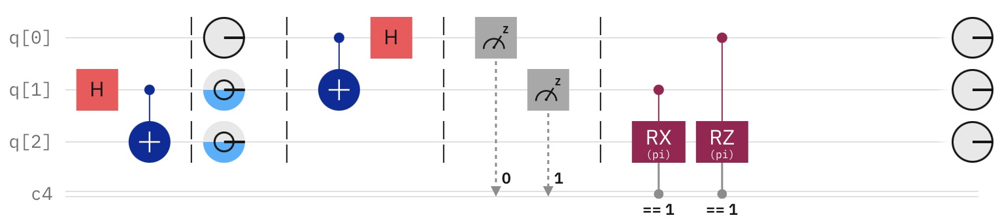
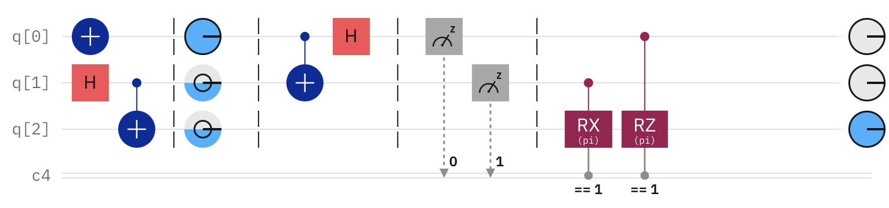

# Quantum Circuits: Quantum Teleportation

## Overview

This repository contains an implementation of quantum teleportation using Qiskit, demonstrating how to transmit a quantum state from one qubit to another using quantum entanglement and classical communication.

- Quantum teleportation is a technique for moving quantum states in the absence of communication channels linkning the sender and recipient
- If we want to send information about an arbitrary qubit $|\Psi⟩$, we can do this by its interaction with one half of an EPR pair.
- Based on the interaction and measurement of $|\Psi⟩$ with one half of the EPR pair, by measuring the second half, and knowing the classical results of the first measurement, we may determine the state $|\Psi⟩$.
- SIGNIFICANCE

# Quantum Teleportation

## Objective:

The aim of a quantum teleportation circuit is to transfer information about a quantum state through its interaction with an entangled EPR pair.

## The Circuit:

  

<i>Quantum teleportation circuit, created with IBM composer and the Qiskit SDK. An arbitrary qubit interacts with an entangled Bell state via a CNOT followed by a Hadamard gate. Measurements are made of the arbitrary qubit and one half of the EPR pair, and the relavant transformations are made to the second half of the EPR pair depending on the results of this measurement.</i>

 

## The Process:

### Preliminary States:

Let some arbitrary quantum state $|\Psi\rangle$ be:

$$|\Psi \rangle = \alpha |0\rangle + \beta |1\rangle$$

Where $\alpha$ and $\beta$ satisfy the Born rule (the absolute values of $\alpha$ and $\beta$ are proportional to the probability of $|\Psi\rangle$ being in state $|0\rangle$ and $|1\rangle$ respectively, and $\alpha^2 + \beta^2 = 1$).

This state, $|\Psi\rangle$, is the state we will be transmitting via its interaction with a separate entangled pair of qubits.

Next, consider an EPR pair in the $|\beta_{00}$ state. There are four Bell states, however this one is chosen for convenience.

$$|\beta_{00} \rangle = \frac{1}{\sqrt{2}} (|00⟩ + |11⟩)$$

The qubits in this EPR pair are separated in space, and we therefore have three qubits to consider:

$$|\Psi\rangle = \alpha |0\rangle + \beta |1\rangle$$

and the two entangled qubits:

$$|\beta_{00} \rangle = \frac{1}{\sqrt{2}} (|00⟩ + |11⟩)$$

### The Circuit - Interactions and Encoding:

Now, to begin with we have the state

$$|\Psi_0\rangle = |\Psi\rangle |\beta_{00}\rangle$$

at the start of the circuit. This becomes:

$$|\Psi_0\rangle = (\alpha |0\rangle + \beta |1\rangle)(\frac{1}{\sqrt{2}} (|00⟩ + |11⟩)) = \frac{1}{\sqrt{2}} [\alpha |0\rangle (|00\rangle |11\rangle) + \beta|1\rangle(|00\rangle + |11\rangle)]$$

Where the leftmost qubits are owned by our sender of $|\Psi\rangle$ and the right most are owned by ther recipient.

The state $|\Psi_0\rangle$ interacts with a CNOT gate, which flips the second qubit if the first is $|0\rangle$:

$$|\Psi_1\rangle = \frac{1}{\sqrt{2}} [\alpha |0\rangle (|00\rangle |11\rangle) + \beta|1\rangle(|10\rangle + |01\rangle)]$$

and then interacts with a Hadamard gate, transforming the basis states into a superposition:

$$|\Psi_2\rangle = \frac{1}{2} [\alpha (|0\rangle + |1\rangle)(|00\rangle |11\rangle) + \beta(|0\rangle - |1\rangle )(|10\rangle + |01\rangle)]$$

The order of these gates and interactions is important: the CNOT gate encodes the quantum information of the first state into the interaction between $|\Psi\rangle$ and $|\beta_{00}$ before it is placed into a superposition by the Hadamard gate.

### The Circuit - Measurement:

The state $|\Psi_2\rangle$ can be rewritten by regrouping terms and using the associative property of tensor products:

$$|\Psi_2\rangle = \frac{1}{2}[|00\rangle(\alpha|0\rangle + \beta|1\rangle) + |01\rangle(\alpha|1\rangle + \beta|0\rangle) + |10\rangle(\alpha|0\rangle - \beta|1\rangle) + |11\rangle(\alpha|1\rangle - \beta|0\rangle)]$$

Measurement is then made of the arbitrary qubit $|\Psi\rangle$ and the senders half of the EPR pair. Based on the outcomes of these measurements we may determine the state of the third qubit, the second half of the EPR pair owned by the recipient. 

For example, if the state is measured to be $|00\rangle$, the third qubit is in the state $|\Psi\rangle = \alpha |0\rangle + \beta |1\rangle$. If other results come from the measurement, we make the required transformations to restore the third qubit to the correct state:

$$00 \rightarrow |\psi_3(00)\rangle \equiv \alpha|0\rangle + \beta|1\rangle$$

$$01 \rightarrow |\psi_3(01)\rangle \equiv \alpha|1\rangle + \beta|0\rangle$$

$$10 \rightarrow |\psi_3(10)\rangle \equiv \alpha|0\rangle - \beta|1\rangle$$

$$11 \rightarrow |\psi_3(11)\rangle \equiv \alpha|1\rangle - \beta|0\rangle$$

So if the first qubit is measured to be $|1\rangle$, we rotate $\pi$ radians using a $Z$ gate, and if the second qubit is measured to be $|1\rangle$, we rotate $\pi$ radians using an $X$ gate.

## Results:

These results are demonstrated in IBM composer below:

  

<i>Quantum teleportation circuit, created with IBM composer and the Qiskit SDK. An arbitrary qubit interacts with an entangled Bell state via a CNOT followed by a Hadamard gate. Measurements are made of the arbitrary qubit and one half of the EPR pair, and the relavant transformations are made to the second half of the EPR pair depending on the results of this measurement.</i>

 

  

<i>Quantum teleportation circuit, created with IBM composer and the Qiskit SDK. An arbitrary qubit interacts with an entangled Bell state via a CNOT followed by a Hadamard gate. Measurements are made of the arbitrary qubit and one half of the EPR pair, and the relavant transformations are made to the second half of the EPR pair depending on the results of this measurement.</i>

 
