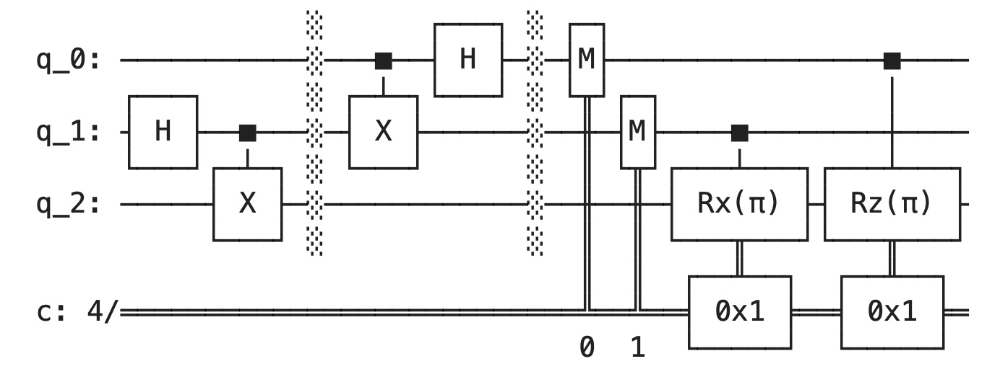

# Quantum Circuits: Quantum Teleportation

This repository contains an implementation of quantum teleportation using Qiskit, demonstrating how to transmit a quantum state from one qubit to another using quantum entanglement and classical communication.

### Overview

- Quantum teleportation is a technique for moving quantum states in the absence of communication channels linkning the sender and recipient
- If we want to send information about an arbitrary qubit $|\Psi⟩$, we can do this by its interaction with one half of an EPR pair.
- Based on the interaction and measurement of $|\Psi⟩$ with one half of the EPR pair, by measuring the second half, and knowing the classical results of the first measurement, we may determine the state $|\Psi⟩$.
- SIGNIFICANCE

### Quantum Teleportation

## Objective:

The aim of a quantum teleportation circuit is to transfer information about a quantum state through its interaction with an entangled EPR pair.

## The Circuit:

  

<i>Quantum teleportation circuit, created with IBM composer and the Qiskit SDK. An arbitrary qubit interacts with an entangled Bell state via a CNOT followed by a Hadamard gate. Measurements are made of the arbitrary qubit and one half of the EPR pair, and the relavant transformations are made to the second half of the EPR pair depending on the results of this measurement.</i>

 

Let some arbitrary quantum state $|\Psi\rangle$ be:

$$|\Psi \rangle = \alpha |0\rangle + \beta |1\rangle$$

Where $\alpha$ and $\beta$ satisfy the Born rule, where the absolute values of $\alpha$ and $\beta$ are proportional to the probability of $|\Psi\rangle$ being in state $|0\rangle$ and $|1\rangle$ respectively, and $\alpha^2 + \beta^2 = 1$.

This state, $|\Psi\rangle$, is the state we will be transmitting via its interaction with a separate entangled pair of qubits.

Next, consider an EPR pair in the $|\beta_{00}$ state. There are four Bell states, however this one is chosen for convenience.

$$|\beta_{00} \rangle = \frac{1}{\sqrt{2}} (|00⟩ + |11⟩)$$
